# Nova Bank Architecture Diagram

This document presents a comprehensive overview of the Nova Bank system architecture. The system is designed as a modern, containerized monorepo containing a Next.js frontend, a NestJS backend REST API, a PostgreSQL database, and various external integrations.

---

## 1. Core Architecture Overview

Nova Bank's architecture consists of a client browser, an application container running both Next.js and NestJS concurrently, a database container, and several external cloud services.

```mermaid
graph TB
    subgraph ClientUserLayer ["Client / User Layer"]
        browser["Browser (Vite/Next.js SPA)"]
        ui_admin["Admin Panel"]
        ui_dashboard["Dashboard & Transfer"]
        ui_ai["AI Spend Insights & Chat"]
        browser --> ui_admin
        browser --> ui_dashboard
        browser --> ui_ai
    end

    subgraph ContainerEnv ["Container Environment (Docker Compose)"]
        subgraph FrontendServer ["Frontend Server (Next.js - Port 3000)"]
            nextjs["Next.js Pages & Router"]
            apiclient["Api Client (Axios + Interceptors)"]
            authcontext["Auth Context (JWT State)"]
        end

        subgraph BackendAPI ["Backend API (NestJS - Port 4000)"]
            nestjs["NestJS Application Context"]
            
            subgraph Controllers ["Controllers (Routing & Validation)"]
                ctrl_auth["AuthController"]
                ctrl_admin["AdminController"]
                ctrl_accounts["AccountsController"]
                ctrl_transfer["TransferController"]
                ctrl_ai["AiController"]
                ctrl_savings["SavingsJarsController"]
            end
            
            subgraph Services ["Services (Business Logic)"]
                srv_auth["AuthService"]
                srv_admin["AdminService"]
                srv_accounts["AccountsService"]
                srv_transfer["TransferService"]
                srv_ai["AiService"]
                srv_mail["MailService"]
                srv_s3["S3Service"]
            end
            
            subgraph Entities ["TypeORM Entities (Data Models)"]
                ent_user["User Entity"]
                ent_account["Account Entity"]
                ent_tx["Transaction Entity"]
                ent_jar["SavingsJar Entity"]
                ent_audit["AuditLog Entity"]
            end
        end

        subgraph Database ["Database (PostgreSQL - Port 5432)"]
            postgres_db[("PostgreSQL Database<br>(Nova Schema)")]
        end
    end

    subgraph ExternalServices ["External Cloud Services"]
        aws_s3["AWS S3 Bucket<br>(Profile Picture Storage)"]
        gemini_ai["Google Gemini API<br>(Spend Advisory AI)"]
        smtp_mail["SMTP Server<br>(Gmail Notification Service)"]
    end

    %% Client communication to Frontend & Backend
    browser -.->|HTTP/HTML request| nextjs
    apiclient ==>|"REST API Client - JWT bearer auth"| ctrl_auth
    apiclient ==>|"REST API Client - JWT bearer auth"| ctrl_admin
    apiclient ==>|"REST API Client - JWT bearer auth"| ctrl_accounts
    apiclient ==>|"REST API Client - JWT bearer auth"| ctrl_transfer
    apiclient ==>|"REST API Client - JWT bearer auth"| ctrl_ai
    apiclient ==>|"REST API Client - JWT bearer auth"| ctrl_savings

    %% Next.js inside relations
    nextjs --> authcontext
    nextjs --> apiclient

    %% NestJS Router mappings to Services
    ctrl_auth --> srv_auth
    ctrl_admin --> srv_admin
    ctrl_accounts --> srv_accounts
    ctrl_transfer --> srv_transfer
    ctrl_ai --> srv_ai
    ctrl_savings --> srv_accounts

    %% Services interactions
    srv_auth --> srv_mail
    srv_admin --> ent_audit
    srv_accounts --> ent_account
    srv_transfer --> ent_tx
    srv_ai --> gemini_ai
    srv_auth --> ent_user
    srv_accounts --> srv_s3
    srv_s3 --> aws_s3
    srv_auth --> srv_s3
    srv_mail --> smtp_mail

    %% Database mapping
    ent_user -.->|TypeORM| postgres_db
    ent_account -.->|TypeORM| postgres_db
    ent_tx -.->|TypeORM| postgres_db
    ent_jar -.->|TypeORM| postgres_db
    ent_audit -.->|TypeORM| postgres_db
```

---

## 2. Key Components

### A. Frontend: Next.js Client
* **Technology**: Next.js, React 19, Vanilla CSS (Premium HSL glassmorphism dark theme).
* **Port**: Configured on port `3000` to prevent collisions.
* **State Management**: React `AuthContext` managing JWT token lifecycles and login/signup routines.
* **API Client**: [api-client.ts](file:///c:/Users/justc/Desktop/HAck%20to%20night/hack-to-night-2026-challenge-main/hack-to-night-2026-challenge-main/lib/api-client.ts) wraps Axios with custom interceptors to automatically append JWT bearer credentials and parse response metadata.

### B. Backend: NestJS Core Engine
* **Technology**: NestJS, Bun Runtime environment.
* **Port**: Configured on port `4000`.
* **Database Driver**: TypeORM mapping objects directly to PostgreSQL.
* **Module Structure**: Modular architecture split into cohesive resource domains (e.g., `UsersModule`, `AccountsModule`, `AdminModule`, `TransferModule`, `SavingsJarsModule`, `AiModule`, `MailModule`).
* **Cross-Cutting Concerns**: 
  - **Guards**: `JwtAuthGuard` for auth protection, and `RolesGuard` to verify user permissions (e.g., admin check).
  - **Filters**: `HttpExceptionFilter` intercepts errors to deliver neat, sanitized JSON payloads.
  - **Interceptors**: `TransformInterceptor` wraps successful HTTP responses in a standard `{ ok: true, data: ... }` JSON schema.

### C. Database Layer: PostgreSQL
* **Technology**: PostgreSQL 17-alpine (Dockerized container).
* **Port**: Configured on port `5432` mapping internally.
* **Tables/Schema**:
  - `users`: Credentials, emails, verification codes, profile picture URIs, and user roles (`user` or `admin`).
  - `accounts`: Financial accounts (checking, savings) mapped by account numbers, tracking user ownership and balances.
  - `transactions`: Log of all transfers, deposits, and bill splits.
  - `audit_logs`: Keeps track of administrative activities (role promotions, balance overrides).
  - `savings_jars`: Tracks targets, savings, and custom configurations.

### D. Third-Party Integrations
* **AWS S3**: Handles profile picture asset storage via `S3Service`.
* **Google Gemini AI**: Utilizes the `@google/generative-ai` package inside `AiService` to extract personalized spending advice and power the interactive banking assistant interface.
* **SMTP (Gmail)**: Uses `nodemailer` to dispatch account registration codes and transaction alerts.

---

## 3. Data & Request Flow Lifecycle

### 1. User Authentication (JWT)
1. User logs in from Next.js -> `/auth/login` endpoint on NestJS.
2. `AuthService` validates the hashed password using `bcryptjs`.
3. Returns a signed JWT token to the browser.
4. Next.js saves the token in state and attaches it to all outgoing API calls inside header authorization: `Bearer <token>`.

### 2. Transaction Handling (Balance Adjustment / Transfers)
1. Browser fires transaction call `/transfer` or admin balance adjustments `/admin/accounts/:number/adjust-balance`.
2. NestJS applies `JwtAuthGuard` and processes roles checks.
3. Services wrap queries in database transactions using TypeORM's `DataSource` to guarantee ACID compliance.
4. If successful, updates accounts tables, registers audit logs, and returns the response wrapped by `TransformInterceptor`.
