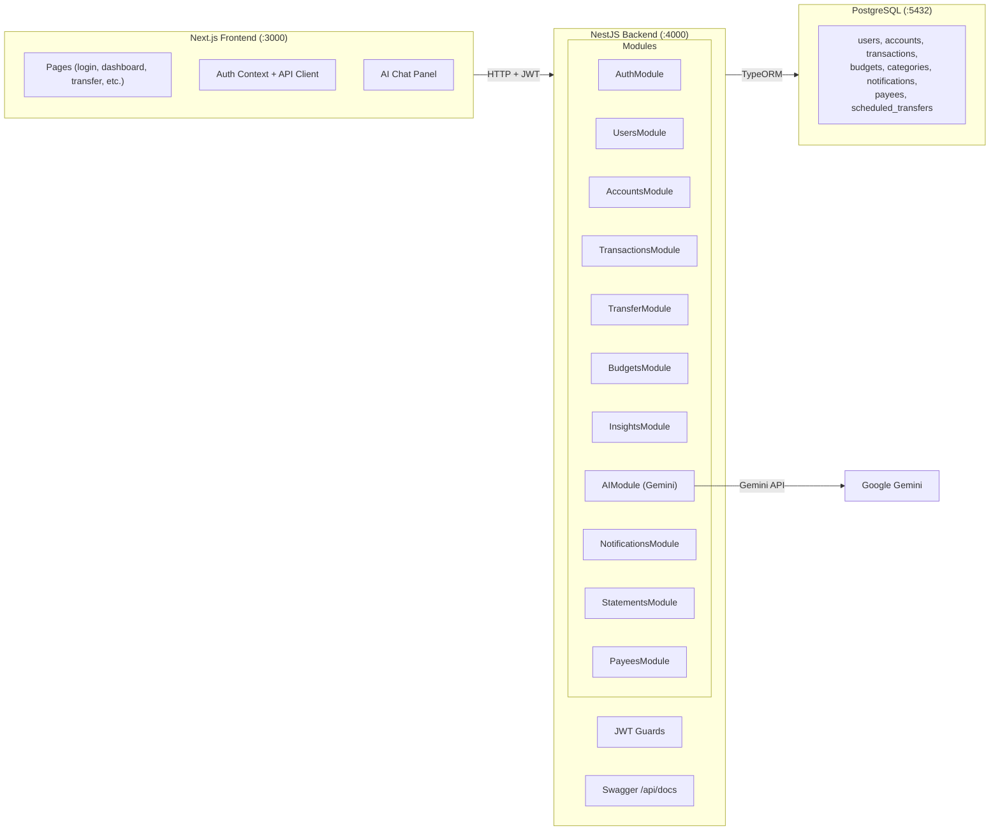

# Nova Bank — Full Implementation Plan (NestJS + Next.js + Gemini AI)

## Architecture



**Stack decisions:**
- **Backend**: NestJS + TypeORM + Passport JWT + class-validator + Swagger
- **Frontend**: Next.js (client-only, no API routes) 
- **AI**: Google Gemini (`@google/generative-ai`)
- **DB**: PostgreSQL (existing)
- **Infra**: Docker Compose (3 services: `web`, `api`, `db`)

---

## Phase 1: NestJS Scaffold + Core Modules + Connect Frontend

### 1A — Scaffold NestJS Backend

#### [NEW] `server/` — NestJS project

Create separate NestJS app at `server/` alongside the existing Next.js app:

```
server/
├── src/
│   ├── main.ts                     # Bootstrap, CORS, Swagger, ValidationPipe
│   ├── app.module.ts               # Root module
│   ├── common/
│   │   ├── guards/
│   │   │   └── jwt-auth.guard.ts   # Passport JWT guard
│   │   ├── decorators/
│   │   │   ├── current-user.decorator.ts  # @CurrentUser() param decorator
│   │   │   └── roles.decorator.ts  # @Roles('admin') decorator
│   │   ├── interceptors/
│   │   │   └── transform.interceptor.ts   # Uniform { ok, data, message } responses
│   │   ├── filters/
│   │   │   └── http-exception.filter.ts   # Safe error responses (no leaks)
│   │   └── pipes/
│   │       └── validation.pipe.ts
│   ├── config/
│   │   └── database.config.ts      # TypeORM config from env
│   ├── auth/
│   │   ├── auth.module.ts
│   │   ├── auth.controller.ts      # POST /auth/login, POST /auth/register, POST /auth/reset-password
│   │   ├── auth.service.ts         # bcrypt hash/compare, JWT sign/verify
│   │   ├── strategies/
│   │   │   └── jwt.strategy.ts     # Passport JWT strategy
│   │   └── dto/
│   │       ├── login.dto.ts        # class-validator: username, password
│   │       └── register.dto.ts     # class-validator: username, password, fullName, email, nic
│   ├── users/
│   │   ├── users.module.ts
│   │   ├── users.service.ts
│   │   └── entities/
│   │       └── user.entity.ts      # TypeORM entity
│   ├── accounts/
│   │   ├── accounts.module.ts
│   │   ├── accounts.controller.ts  # GET /accounts (user's accounts)
│   │   ├── accounts.service.ts
│   │   └── entities/
│   │       └── account.entity.ts
│   ├── transactions/
│   │   ├── transactions.module.ts
│   │   ├── transactions.controller.ts  # GET /transactions?account=X
│   │   ├── transactions.service.ts
│   │   └── entities/
│   │       └── transaction.entity.ts
│   ├── transfer/
│   │   ├── transfer.module.ts
│   │   ├── transfer.controller.ts  # POST /transfer
│   │   ├── transfer.service.ts     # Atomic transaction with ownership + balance check
│   │   └── dto/
│   │       └── transfer.dto.ts
│   ├── search/
│   │   ├── search.module.ts
│   │   ├── search.controller.ts    # GET /search?q=X
│   │   └── search.service.ts
│   ├── admin/
│   │   ├── admin.module.ts
│   │   ├── admin.controller.ts     # GET /admin/system (admin-only)
│   │   └── admin.service.ts
│   └── health/
│       └── health.controller.ts    # GET /health
├── package.json
├── tsconfig.json
├── tsconfig.build.json
├── nest-cli.json
└── .env
```

**Key NestJS features used:**
- **TypeORM** entities + repository pattern (no raw SQL)
- **Passport + @nestjs/jwt** for authentication
- **class-validator + class-transformer** for DTO validation
- **Global exception filter** that never leaks internals
- **@nestjs/swagger** for auto-generated API docs at `/api/docs`
- **CORS** configured for the Next.js frontend origin

---

### 1B — Connect Frontend

#### [MODIFY] Remove all `app/api/` routes
Delete the entire `app/api/` directory — backend is now NestJS.

#### [NEW] `lib/api-client.ts`
```typescript
// Shared fetch wrapper pointing to NestJS backend
const API_BASE = process.env.NEXT_PUBLIC_API_URL || 'http://localhost:4000'

export async function apiClient<T>(path: string, options?: RequestInit): Promise<T> {
  const token = localStorage.getItem('session_token')
  const res = await fetch(`${API_BASE}${path}`, {
    ...options,
    headers: {
      'Content-Type': 'application/json',
      ...(token ? { Authorization: `Bearer ${token}` } : {}),
      ...options?.headers,
    },
  })
  if (!res.ok) throw await res.json()
  return res.json()
}
```

#### [NEW] `lib/auth-context.tsx`
React context with `useAuth()` hook:
- `login(username, password)` → calls NestJS `POST /auth/login`
- `register(...)` → calls NestJS `POST /auth/register`
- `logout()` → clears token, redirects to `/login`
- `user` state (id, username, role, fullName)
- Auto-redirect middleware for protected pages

#### [MODIFY] All page files
Wire up every page to use `apiClient` + `useAuth()`:
- `app/(accounts)/login/page.tsx` — real login flow
- `app/(accounts)/sign-up/page.tsx` — real registration
- `app/(accounts)/reset-password/page.tsx` — real reset flow
- `app/dashboard/page.tsx` — fetch accounts, transactions, payees
- `app/bank-accounts/page.tsx` — fetch from API
- `app/bank-transfer/page.tsx` — call transfer API
- `app/pay-bills/page.tsx` — use real balance + transfer
- `app/e-statement/page.tsx` — fetch transaction data

---

### 1C — Docker Compose Update

#### [MODIFY] `compose.yml`
Add NestJS service:
```yaml
services:
  db:
    image: postgres:16-alpine
    # ... existing config

  api:
    build: ./server
    ports: ["4000:4000"]
    environment:
      DATABASE_URL: postgresql://postgres:${POSTGRES_PASSWORD}@db:5432/${POSTGRES_DB}
      JWT_SECRET: ${JWT_SECRET}
      GEMINI_API_KEY: ${GEMINI_API_KEY}
    depends_on: [db]

  web:
    build: .
    ports: ["3000:3000"]
    environment:
      NEXT_PUBLIC_API_URL: http://api:4000
    depends_on: [api]
```

---

## Phase 2: Smart Spend (Budgeting & Analytics)

### Backend

#### [NEW] `server/src/budgets/`
- `budget.entity.ts` — user_id, category, monthly_limit
- `budgets.controller.ts` — CRUD for budget categories
- `budgets.service.ts`

#### [NEW] `server/src/insights/`
- `insights.controller.ts` — `GET /insights/spending-summary`, `GET /insights/trends`
- `insights.service.ts` — aggregate queries:
  - Monthly spending by category
  - 6-month trend data
  - Budget vs actual comparison
  - Top payees

#### [NEW] `server/src/categories/`
- `transaction-category.entity.ts` — links transactions to categories
- `categories.service.ts` — keyword-based categorization (Food, Transport, Bills, Shopping, etc.)

### Frontend

#### [MODIFY] `app/smart-spend/page.tsx`
Full analytics dashboard:
- **Spending donut chart** (inline SVG) — breakdown by category
- **Trend line chart** (inline SVG) — 6-month spending history
- **Budget cards** — progress bars showing limit vs spent per category
- **Set budgets** — modal form to add/edit category limits
- **Alerts** — warning when spending > 80% of budget

---

## Phase 3: AI Features (Gemini RAG)

### Backend

#### [NEW] `server/src/ai/`
```
ai/
├── ai.module.ts
├── ai.controller.ts          # POST /ai/chat, GET /ai/anomalies
├── ai.service.ts             # Core Gemini integration
├── rag.service.ts            # RAG pipeline: query DB → build context → prompt Gemini
├── categorizer.service.ts    # AI-powered transaction categorization
└── anomaly-detector.service.ts  # Rule-based anomaly detection
```

**RAG Pipeline:**
1. User sends message → `POST /ai/chat`
2. `rag.service.ts` queries user's accounts, recent transactions, budgets from DB
3. Builds structured context: balances, spending summary, transaction list
4. Sends to Gemini with financial advisor system prompt
5. Returns AI response

**Anomaly Detection (rule-based, no ML):**
- Amount > 3× user's average transaction
- Transfer to never-seen-before account with amount > threshold
- Multiple transfers within 5 minutes
- Transaction at unusual hours (2am-5am)

**Auto-categorization:**
- First pass: keyword matching (fast, free)
- Fallback: Gemini API for ambiguous descriptions

### Frontend

#### [NEW] `components/ai-chat.tsx`
Floating chat panel:
- Bottom-right chat bubble with Nova Bank AI avatar
- Expandable chat window with message history
- Quick suggestion chips: "Spending summary", "Budget check", "Suspicious activity"
- Glassmorphism design with smooth animations
- Typing indicator during AI response

#### [MODIFY] `app/dashboard/page.tsx`
- **AI Insights card** — AI-generated one-liner about spending
- **Anomaly alerts** — warning badges for suspicious transactions

#### [MODIFY] `app/smart-spend/page.tsx`
- **AI Summary** — natural language spending analysis
- **"Ask AI" button** — opens chat with finance context pre-loaded

---

## Phase 4: Notifications

### Backend

#### [NEW] `server/src/notifications/`
- `notification.entity.ts` — user_id, type, title, message, read, created_at
- `notifications.controller.ts` — `GET /notifications`, `PATCH /notifications/:id/read`
- `notifications.service.ts` — create notifications on: transfer, budget exceeded, anomaly
- `notifications.gateway.ts` — SSE (Server-Sent Events) for real-time push

### Frontend

#### [NEW] `components/notification-center.tsx`
- Bell icon with unread badge count
- Dropdown panel with notification list
- Click to mark as read
- Real-time updates via SSE

---

## Phase 5: Advanced Features

### PDF Statement Export
#### [NEW] `server/src/statements/`
- `statements.controller.ts` — `GET /statements/pdf?account=X&from=DATE&to=DATE`
- Generate HTML → PDF using `puppeteer` or `pdfkit`
- Download with proper Content-Disposition header

#### [MODIFY] `app/e-statement/page.tsx`
- "Download PDF" button

### Scheduled Transfers
#### [NEW] `server/src/scheduled-transfers/`
- `scheduled-transfer.entity.ts` — from, to, amount, frequency, next_run, active
- CRUD controller
- Cron job to execute due transfers

### Payee Management
#### [NEW] `server/src/payees/`
- `payee.entity.ts` — user_id, name, account_number, bank
- CRUD controller
- Used in transfer form for quick selection

---

## Phase 6: Polish & UX

- **Dark mode** — CSS custom properties toggle, persisted in localStorage
- **Loading skeletons** — shimmer placeholders while data loads
- **Toast notifications** — success/error feedback component
- **Responsive audit** — ensure all pages work on mobile
- **Accessibility** — ARIA labels, keyboard navigation, focus management
- **Page transitions** — smooth route change animations

---

## Environment Variables

Add to `.env.local`:
```env
# Existing
POSTGRES_USER=postgres
POSTGRES_PASSWORD=supersecurepassword
POSTGRES_DB=htn26db
DATABASE_URL=postgresql://postgres:supersecurepassword@db:5432/htn26db

# New
JWT_SECRET=your-random-64-char-hex-string
GEMINI_API_KEY=your-gemini-api-key
NEXT_PUBLIC_API_URL=http://localhost:4000
```

---

## Execution Order

| Phase | Estimated Files | Depends On |
|-------|-----------------|------------|
| 1A: NestJS scaffold + core modules | ~25 | Nothing |
| 1B: Connect frontend | ~12 | 1A |
| 1C: Docker Compose | ~2 | 1A |
| 2: Smart Spend | ~8 | 1 |
| 3: AI (Gemini RAG) | ~10 | 1 + 2 |
| 4: Notifications | ~5 | 1 |
| 5: Advanced | ~8 | 1 |
| 6: Polish | ~8 | All |

---

## Verification Plan

### Per Phase
- `cd server && npm run build` — NestJS compiles
- `cd .. && npm run build` — Next.js compiles
- Swagger docs accessible at `http://localhost:4000/api/docs`

### End-to-End
- Login → Dashboard shows real data
- Transfer → balance updates in both accounts
- AI Chat → responds with actual spending data
- Anomaly → large transfer triggers alert
- PDF → downloads correct statement
- Budget → exceeding limit shows warning
